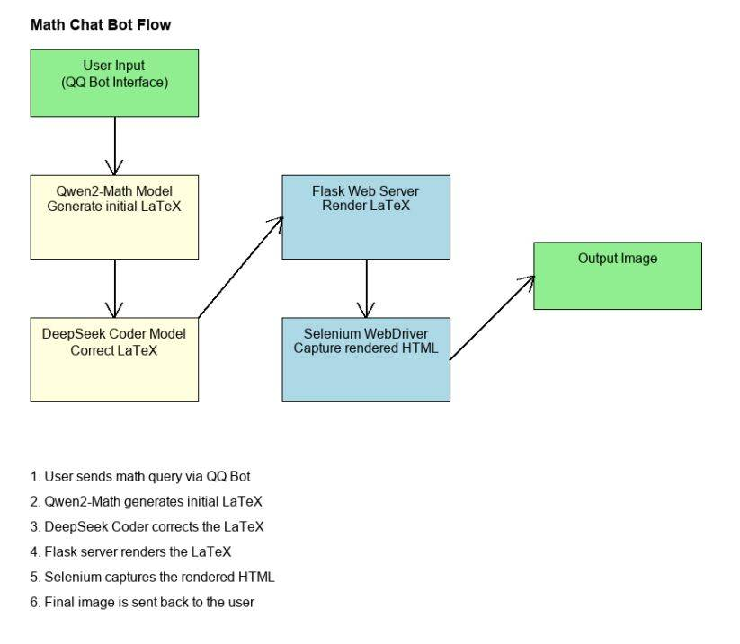

# Math_prompt
Codes to use qwen2-math api for constructing qq-bot

## Process



## PIP
```bash
pip install -r requirements.txt
```

## Others

1. You can focus solely on the prompt for this project, and you can also integrate other LLM API services or apply this project to other applications, such as qq-bot or wechat-bot.

2. For different LLM APIs, you may need to change some settings in `math_api.py`.
